# <p align="center"> <br>TechPrep AI</p>

<p align="center">
  <strong>The All-in-One Intelligent Career & Technical Interview Preparation Operating System</strong>
</p>

<p align="center">
  <a href="#key-features"></a>
  <a href="#quick-start"></a>
  <a href="#tech-stack"></a>
  <a href="LICENSE"></a>
  <a href="#architecture"></a>
</p>

<p align="center">
  <a href="#executive-summary">About</a> •
  <a href="#ui-showcase--screenshots">Screenshots</a> •
  <a href="#key-features">Key Features</a> •
  <a href="#architecture">Architecture</a> •
  <a href="#project-structure">Project Structure</a> •
  <a href="#quick-start">Quick Start</a> •
  <a href="#deep-dive-modules">Module Deep Dives</a> •
  <a href="#data-persistence--storage-keys">Data & Storage</a> •
  <a href="#roadmap">Roadmap</a> •
  <a href="#contributing">Contributing</a>
</p>

---

## Executive Summary

**TechPrep AI** is an end-to-end, high-performance web platform crafted for computer science students, software engineering aspirants, and career transitioners targeting Tier-1 tech companies, FAANG, and high-growth startups.

Traditional interview preparation is fragmented across disparate platforms — LeetCode for DSA, Overleaf or Reactive Resume for resume generation, Notion or spreadsheets for tracking job drives, and random websites for aptitude tests. **TechPrep AI unifies the entire placement lifecycle into a single, cohesive, lightning-fast workstation with zero server bloat.**

<p align="center">
  
</p>

```
                     ┌────────────────────────────────────────────────────────┐
                     │                      TechPrep AI                       │
                     └───────────────────────────┬────────────────────────────┘
                                                 │
      ┌──────────────────┬───────────────────────┼──────────────────────┬──────────────────┐
      ▼                  ▼                       ▼                      ▼                  ▼
┌───────────┐    ┌───────────────┐     ┌──────────────────┐    ┌─────────────────┐  ┌──────────────┐
│  DSA IDE  │    │  ATS Resume   │     │ Placement Tracker│    │ Quiz Assessment │  │  Admin Hub   │
│  & Runner │    │  & AI Scanner │     │  (Kanban Board)  │    │ & Bulk Importer │  │ & CMS Studio │
└───────────┘    └───────────────┘     └──────────────────┘    └─────────────────┘  └──────────────┘
```

---

## UI Showcase & Screenshots

Explore the rich user interface and end-to-end preparation modules available inside TechPrep AI:

### 1. In-Browser DSA Problem Studio & Code Runner
Multi-language client-side execution sandbox (JavaScript, Python, C++, Java) with curated company tags, sample testcase validation, and acceptance telemetry.
<p align="center">
  
</p>

---

### 2. ATS-Grade Resume Builder & Live Intelligence Scanner
Real-time ATS scoring analyzer (99% score validation), instant recruiter-grade template switcher, custom palette selector, and pixel-perfect A4 PDF export.
<p align="center">
  
</p>

---

### 3. Campus & Off-Campus Placement Command Center
Interactive drag-and-drop Kanban pipeline tracking drives from Wishlist to Offer, with package metrics (CTC in LPA), deadlines, and interview schedules.
<p align="center">
  
</p>

---

### 4. Interactive Quiz & Technical Assessment Portal
Mock examination portal supporting topic filters (JavaScript, DSA Trees/Graphs, DBMS), question timers, and instant diagnostics.
<p align="center">
  
</p>

---

### 5. Notes & Daily Study Planner Workspace
Integrated CS revision notes organizer, weekly milestone targets, and gamified activity streak tracking.
<p align="center">
  
</p>

---

### 6. Student Profile, Academics & Credentials Hub
Complete profile management tracking personal details, college academics (CGPA, 10th/12th scores), and external coding profiles (LeetCode, GitHub, LinkedIn).
<p align="center">
  
</p>
<p align="center">
  
</p>

---

### 7. Authentication & Security Gateway
Streamlined, glassmorphic login modal with client-side credential verification and role-based redirecting.
<p align="center">
  
</p>

---

## Key Features

### 1. In-Browser DSA Problem Studio & Code Runner
- **Multi-Language Sandbox**: Write and execute algorithms in JavaScript, Python, C++, and Java.
- **Pre-loaded Curated Question Bank**: Includes classic patterns (Two Sum, Valid Anagram, Reverse Linked List, Binary Tree Inversion) with curated company tags (Google, Meta, Amazon, Microsoft, Apple, Uber).
- **Testcase Evaluator & Visual Assertion**: Real-time evaluation against custom and seed test cases with execution time and pass/fail telemetry.
- **Company & Category Filters**: Slice questions by Topic (*Arrays & Hashing*, *Two Pointers*, *Trees*, *Graphs*, *DP*) or Target Company.

### 2. ATS-Grade Resume Builder & Intelligence Scanner
- **6+ Recruiter-Engineered Templates**: Silicon Valley Standard (ATS #1), Modern Tech Sidebar, Clean Minimal, Senior Staff, and Academic layouts.
- **Live Interactive ATS Score Analyzer**: Evaluates metric quantification, action verb density, section structure completeness, and keyword presence with actionable suggestions.
- **Design Studio**: Custom color palettes (*Sapphire Blue, Slate Obsidian, Emerald Forest, Royal Indigo*) and typography selection (*Inter, JetBrains Mono, Roboto, Outfit, Georgia*).
- **Pixel-Perfect A4 Live Export**: Instant browser print to PDF without third-party watermarks or delays.

### 3. Campus & Off-Campus Placement Command Center
- **Interactive Kanban Pipeline**: Track applications across 6 workflow stages:
  $$\text{Wishlist} \longrightarrow \text{Applied} \longrightarrow \text{Online Assessment} \longrightarrow \text{Technical Round} \longrightarrow \text{HR / Final} \longrightarrow \text{Offer Received}$$
- **Package & Metric Insights**: Track CTC / stipend metrics (LPA / USD), application deadlines with live countdown indicators, eligibility criteria, and interview logs.
- **Archive & Filtering Engine**: Instant search by company name, CTC bracket, or recruitment phase.

### 4. Timed Quiz & Technical Assessment Engine
- **Mock Assessment Simulator**: Timed testing environment with question palette, instant flagged questions, and autosave.
- **Bulk Question Ingestor**: Upload questions via **CSV**, **Aiken `.txt` format**, **Microsoft Word (`.docx`)**, or **Excel (`.xlsx`)**.
- **Instant Diagnostic Analytics**: Detailed score breakdowns, accuracy percentages, topic-wise strengths/weaknesses, and answer key reviews with explanations.

### 5. AI Preparation Planner & Study Workspace
- **Actionable Task Board**: Track daily DSA problem quotas, resume revisions, and project milestones.
- **Dedicated Rich Notes Hub**: Store algorithmic templates, system design notes, and interview flashcards with instant keyword filtering.
- **Daily Streak Counter**: Gamified consistency tracking to maintain preparation momentum.

### 6. Role-Based Dual Persona (Student vs. Administrator)
- **Student Dashboard**: Personalized performance overview, profile completeness meter, target company tracker, and quick shortcuts.
- **Admin Command Center (`/pages/admin/`)**: Complete administrative suite with full CRUD over quizzes, DSA problem authoring, user directory management, and platform analytics.

---

## Architecture

TechPrep AI is engineered with a **Modular, Client-First Architecture**. It requires **zero build step**, delivers **instant page loads**, and persists state locally through a centralized storage driver.

```mermaid
flowchart TD
    subgraph Client ["Client Browser (Zero-Build Runtime)"]
        UI["Tailwind CSS + Custom Glassmorphism UI"]
        Router["Multi-Page Routing (MPA)"]
        
        subgraph CoreEngine ["Core Shared Runtime (`/js/core/`)"]
            Auth["auth.js (RBAC & Profiles)"]
            Theme["theme.js (Dark / Light Engine)"]
            App["app.js / ui.js (Global Shell & Toast System)"]
        end

        subgraph FeatureEngines ["Feature Modules (`/js/features/`)"]
            DSA["dsa-engine.js + dsa-runner.js"]
            Resume["resume-engine.js + ats-scanner.js"]
            Career["placements.js + placement-tracker.js"]
            Quiz["quiz.js + Bulk File Parsers"]
            Planner["planner.js"]
            Admin["admin/hub.js"]
        end

        subgraph StorageLayer ["Persistence Layer"]
            LS[("Browser LocalStorage Engine")]
        end
    end

    UI --> Router
    Router --> CoreEngine
    CoreEngine --> FeatureEngines
    FeatureEngines <--> StorageLayer
```



---

## Project Structure

```text
TechPrepAI/
├── index.html                       # Modern landing page & feature showcase
├── 404.html                         # Error 404 handler with quick navigation
├── README.md                        # Project documentation & reference
├── .gitignore                       # Git ignore configuration
│
├── photos/                          # High-resolution platform UI screenshots & preview assets
│   ├── Screenshot 2026-08-25 164013.png # Hero landing page & live dashboard preview
│   ├── Screenshot 2026-08-25 164108.png # User authentication & login modal
│   ├── Screenshot 2026-08-25 164135.png # Student quiz assessment dashboard
│   ├── Screenshot 2026-08-25 164222.png # Profile settings & completeness meter
│   ├── Screenshot 2026-08-25 164304.png # Academic scores & coding platform links
│   ├── Screenshot 2026-08-25 164358.png # DSA Problem Studio & in-browser IDE
│   ├── Screenshot 2026-08-25 164416.png # ATS Resume Builder & live score analyzer
│   ├── Screenshot 2026-08-25 164510.png # Placement Application Kanban tracker
│   └── Screenshot 2026-08-25 164534.png # Notes & Daily Study Planner workspace
│
├── css/
│   └── styles.css                   # Global styles, variables, & glassmorphism
│
├── data/
│   ├── sample_quizzes.csv           # Sample bulk quiz questions (CSV format)
│   └── sample_quizzes.txt           # Sample bulk quiz questions (Aiken format)
│
├── js/
│   ├── core/                        # Core runtime infrastructure
│   │   ├── app.js                   # Application bootstrap & lifecycle
│   │   ├── auth.js                  # User authentication, RBAC, profile validation
│   │   ├── theme.js                 # Dark/light theme switcher with persistence
│   │   └── ui.js                    # Modals, toasts, navigation, & responsive UI
│   │
│   ├── features/                    # Domain-specific business logic
│   │   ├── admin/
│   │   │   └── hub.js               # Admin management, bulk importers & CRUD
│   │   ├── career/
│   │   │   ├── placement-tracker.js # Lightweight placement widget state
│   │   │   └── placements.js        # Full Kanban placement pipeline engine
│   │   ├── dsa/
│   │   │   ├── dsa-engine.js        # Problem bank, templates & test runner
│   │   │   └── dsa-runner.js        # Client-side code execution sandbox
│   │   ├── quiz/
│   │   │   └── quiz.js              # Quiz runner, timer, and score calculator
│   │   ├── resume/
│   │   │   ├── ats-scanner.js       # ATS keyword & format analysis engine
│   │   │   └── resume-engine.js     # Resume templates, state & live renderer
│   │   └── user/
│   │       ├── dashboard.js         # Student dashboard stats & metrics
│   │       ├── planner.js           # Tasks, notes, and study planner logic
│   │       └── quiz-user.js         # Student assessment portal logic
│   │
│   └── components/                  # Modular UI section renderers
│       ├── admin/                   # Admin UI modals, users, and quizzes components
│       ├── dsa/                     # Code editor UI & admin studio components
│       ├── landing/                 # Hero, demo, features, footer, & modal partials
│       ├── resume/                  # Builder UI & template selector components
│       └── user/                    # User sidebar, history, and profile components
│
└── pages/
    ├── admin/                       # Administrator portal
    │   ├── admin-hub.html           # Unified admin dashboard & CMS
    │   ├── admin-dsa.html           # DSA problem creator & editor studio
    │   └── admin-resume-studio.html # Resume template manager
    │
    ├── user/                        # Authenticated student workspace
    │   ├── dashboard.html           # Student overview & progress hub
    │   ├── dsa-ide.html             # DSA coding environment & compiler
    │   ├── placements.html          # Kanban placement tracker
    │   ├── planner.html             # Task manager & notes workspace
    │   ├── quiz-user.html           # Interactive quiz taking portal
    │   └── resume-builder.html      # ATS resume creator & PDF export
    │
    └── public/                      # Public documentation & static pages
        ├── docs.html                # Documentation & platform guide
        ├── dsa-sheets.html          # Curated coding preparation sheets
        ├── login.html               # User & Admin login gateway
        ├── signup.html              # Account registration
        ├── partners.html            # University & hiring partner info
        ├── privacy.html             # Privacy policy
        ├── security.html            # Data security standards
        └── terms.html               # Terms of service
```

---

## Tech Stack

| Domain | Technology | Purpose |
| :--- | :--- | :--- |
| **Markup & Structure** | `HTML5 Semantic Markup` | High-performance, SEO-friendly layout structure |
| **Styling & Design** | `Tailwind CSS (v3 CDN)` + `Vanilla CSS` | Fluid typography, glassmorphic dark-mode interface |
| **Scripting & Engine** | `Modern JavaScript (ES6+)` | Component-based modular logic with zero build step |
| **Typography** | `Inter` + `JetBrains Mono` | Optimized for readability and coding environments |
| **Icons & Visuals** | `Custom SVG Iconography` | Zero external font-icon dependencies for instant rendering |
| **Data & Persistence** | `Browser LocalStorage API` | Local, persistent state management with seed failbacks |
| **Export Engines** | `Native CSS Print Media Styles` | High-definition A4 PDF generation for resumes |

---

## Quick Start

TechPrep AI runs instantly with **zero dependencies or npm build steps**. You can clone and launch it in seconds using any local web server.

### Option 1: VS Code Live Server (Recommended)
1. Clone the repository:
   ```bash
   git clone https://github.com/KeshavxGupta/TechPrepAI.git
   cd TechPrepAI
   ```
2. Open in VS Code:
   ```bash
   code .
   ```
3. Right-click on `index.html` and select **"Open with Live Server"**.

### Option 2: Python Built-in Server
```bash
# Python 3
python -m http.server 3000

# Access at http://localhost:3000
```

### Option 3: Node.js (via `serve` or `http-server`)
```bash
npx serve . -l 3000
```

---

## Deep-Dive Modules

### 1. ATS Resume Studio & Scoring Algorithm
The ATS scanner evaluates resumes across four dimensions:
1. **Section Integrity**: Verifies necessary sections (*Summary, Education, Experience, Projects, Skills, Contact*).
2. **Quantifiable Impact**: Rewards metrics (e.g., *% improvement, $ revenue, latency reduction, user count*).
3. **Keyword Density**: Highlights role-critical technical proficiencies.
4. **Layout Readability**: Ensures formatting is single/dual-column parseable by standard ATS parsers (Workday, Greenhouse, Lever).

### 2. Bulk Quiz Importer Compatibility
Administrators can batch-import hundreds of questions in seconds using the **Aiken format** or **CSV**:

**Sample Aiken Format (`.txt`)**:
```text
What is the worst-case time complexity of QuickSort?
A. O(n)
B. O(n log n)
C. O(n^2)
D. O(log n)
ANSWER: C
EXPLANATION: QuickSort degrades to O(n^2) when the pivot selection consistently yields unbalanced partitions.
```

**Sample CSV Format (`.csv`)**:
```csv
Question,OptionA,OptionB,OptionC,OptionD,Answer,Explanation
"What does HTML stand for?","Hyper Text Markup Language","Hyper Tech Markdown Language","High Text Machine Language","Hyperlinks and Text Markup Language","A","HTML is the standard markup language."
```

---

## Data Persistence & Storage Keys

TechPrep AI uses structured LocalStorage namespaces for predictable client-side persistence:

| Storage Key | Type | Description |
| :--- | :--- | :--- |
| `techprep_registered_users` | `Array<User>` | Registered accounts and full profile records |
| `techprep_current_user` | `Object` | Active session metadata |
| `techprep_dsa_problems` | `Array<Problem>` | Custom & seed DSA problem database |
| `techprep_dsa_submissions` | `Array<Submission>`| Code submission history & runtime metrics |
| `techprep_user_resumes` | `Array<Resume>` | User resume drafts, content, and active styles |
| `techprep_placement_drives` | `Array<Drive>` | Placement application board status and metadata |
| `techprep_tasks` | `Array<Task>` | Kanban preparation tasks |
| `techprep_notes` | `Array<Note>` | Revision notes & algorithm cheatsheets |
| `techprep_theme` | `String` | `'dark'` \| `'light'` \| `'system'` |

---

## Roadmap

- [x] **v1.0**: Core Platform Release (DSA IDE, Resume Builder, Placement Tracker, Quiz Engine, Admin Hub).
- [ ] **v1.5**: 
  - [ ] Monaco Code Editor integration with auto-completion and syntax highlighting.
  - [ ] GitHub & LeetCode profile synchronization via public APIs.
  - [ ] AI-assisted resume bullet point rewriter.
- [ ] **v2.0**:
  - [ ] WebRTC-powered AI Voice Mock Interview simulator.
  - [ ] Cloud sync backend with Supabase / Firebase authentication.
  - [ ] Peer-to-peer DSA mock battle arena.

---

## Contributing

Contributions are welcome! Follow these steps:

1. **Fork the Repository**
2. **Create a Feature Branch**:
   ```bash
   git checkout -b feature/AmazingFeature
   ```
3. **Commit your Changes**:
   ```bash
   git commit -m "feat: Add AmazingFeature to DSA IDE"
   ```
4. **Push to the Branch**:
   ```bash
   git push origin feature/AmazingFeature
   ```
5. **Open a Pull Request**

---

## License

Distributed under the **MIT License**. See `LICENSE` for more information.

---

<p align="center">
  Built for ambitious engineers preparing to conquer their dream tech careers.
</p>
